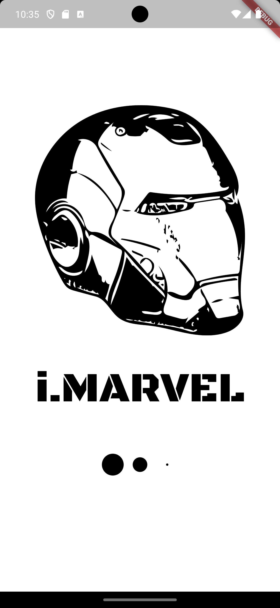
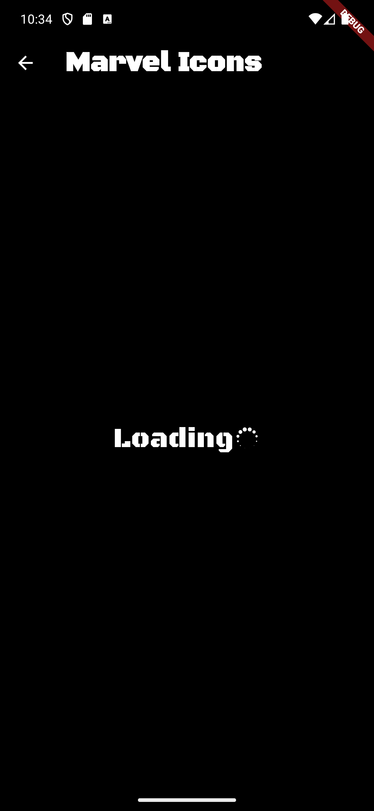
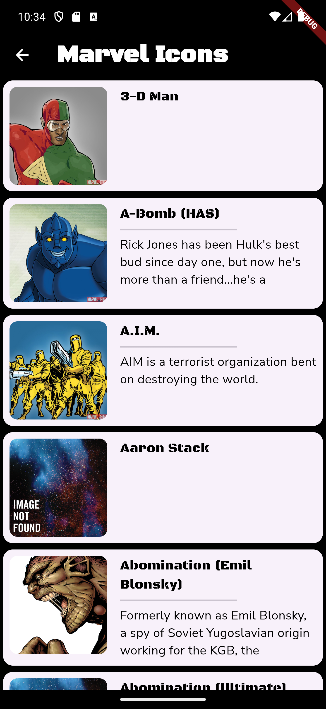
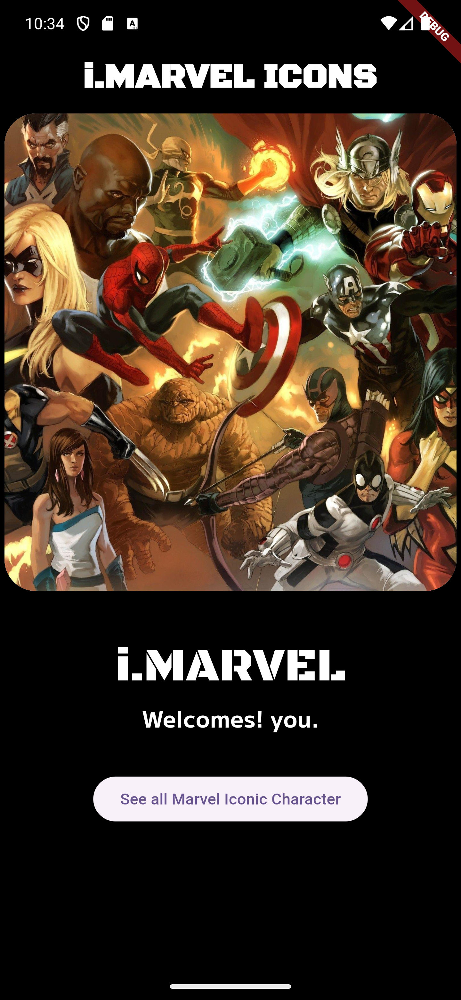
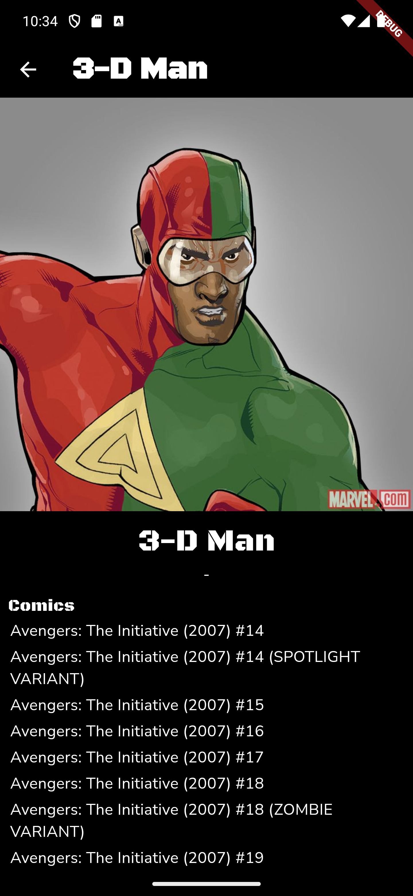

# marvel_icons

A Flutter project to view information of your favorite marvel characters.

## Getting Started

- Clone the project
- Create a Marvel account and use your private and public key.
> Developer account: https://developer.marvel.com/
- Update these values in lib/utils/fetch_marvel_data.dart
- [Start a emulator to launch app](#run-command-for-emulators)
- Open terminal and point to this app directory
- [Update project dependencies](#update-project-dependencies)
- [Run command app](#run-command-app)


### run command for emulators

```cmd
    emulator -avd Pixel_7_Pro_API_34
```
### update project dependencies

```cmd
    flutter pub get
```

### run command app

```cmd
    flutter run
```

## About app

A simple learning showcase of API integration. This shows list of Marvel characters and details.

## App screenshot

     
